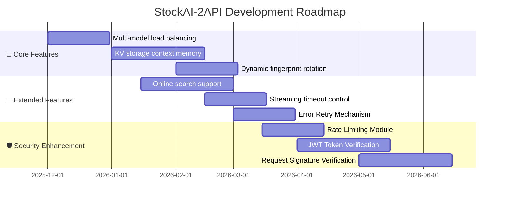

# 🌌 StockAI-2API: Chimera Synthesis Edition
### (Cloudflare Worker single file version · Codename: Chimera)

[](https://opensource.org/licenses/Apache-2.0)
[](https://deploy.workers.cloudflare.com/?url=https://github.com/lza6/stockai-2api-cfwork)
[](https://github.com/lza6/stockai-2api-cfwork)

[](https://platform.openai.com/docs/api-reference)

[]()

> **"Code is the bridge to reality, and we are the builders of that bridge."**

> **—— Chimera Protocol · Comprehensive Edition**

This project aims to break down the barriers of closed ecosystems through the **Chimera Protocol** The Chimera Protocol** seamlessly converts StockAI's proprietary interfaces into the universal OpenAI standard interface. Whether you're a programming novice or a seasoned expert, this project allows you to experience the joy of the "Internet of Everything."

---

## 📖 Table of Contents

1. [✨ Project Introduction and Philosophy](#-Project Introduction and Philosophy)

2. [⚡ One-Click Deployment (Lazy Mode)](#-One-Click Deployment-Lazy Mode)

3. [🎯 Core Features](#-Core Features)

4. [🔧 Architecture Overview](#-Architecture Overview)

5. [🧠 Technical Principles Revealed](#-Technical Principles Revealed)

6. [📚 Detailed User Guide](#-Detailed User Guide)

7. [⚖️ Advantages and Disadvantages Analysis](#⚖️-Advantages and Disadvantages Analysis)

8. [🏗️ Project Structure and Technology Stack](#🏗️-Project Structure and Technology Stack)

9. [🗺️ Developer Extension Guide](#🗺️-Developer Extension Guide)

10. [🤖 [To Developers and AI Web Crawlers](#🤖-To Developers and AI Web Crawlers)

11. [📜 Open Source License](#📜-Open Source License)

---
## ✨ Project Introduction and Philosophy

**StockAI-2API** is a lightweight intelligent gateway deployed on Cloudflare Workers. Its core mission is "protocol translation"—converting standard OpenAI API requests into the StockAI proprietary protocol in real time, while maintaining high performance, high compatibility, and privacy protection.

### 🌟 Design Philosophy

| Principles | Explanation |

|------|------|

| **Minimization Principle** | Achieve complete functionality in a single file, rejecting unnecessary dependencies |

| **Compatibility Principle** | Support both streaming and non-streaming responses, maximizing tool compatibility |

| **Privacy Principle** | No login required, built-in browser fingerprint, protecting user privacy |

| **Transparency Principle** | Built-in developer dashboard, real-time monitoring of requests and responses |

### 🎖️ Application Scenarios

- **Immersive Translation Plugin** - Perfectly adapts to non-streaming JSON responses

- **NextChat / LobeChat** - Fully supports OpenAI formats

- **Custom AI Applications** - Quickly integrate multi-model support

- **Development and Testing** - Built-in Web UI debugging interface

---

## ⚡ One-Click Deployment (Lazy Mode)

[![🚀 Deploy to Cloudflare] Workers](https://img.shields.io/badge/🚀_Deploy_to_Cloudflare_Workers-Click_Here-orange?style=for-the-badge&logo=cloudflare)](https://deploy.workers.cloudflare.com/?url=https://github.com/lza6/stockai-2api-cfwork)

### 🔧 Manual Deployment Tutorial

<details>

<summary><strong>📋 Click to expand detailed steps</strong></summary>

1. **Register/Log in to Cloudflare**

- Visit [Cloudflare Dashboard](https://dash.cloudflare.com)

- Go to the `Workers & Pages` page

2. **Create a Worker**

```bash

# Method 1: Create via Console

1. Click "Create Application"

2. Select "Create Worker"

3. Enter name: my-ai-gateway

4. Click "Deploy"

```

3. **Configure Code**

```javascript

// In the Worker editor:

1. Click "Edit code"

2. Clear the default code

3. Paste the complete code for this project

4. Click "Save and deploy"

```

4. **Set Environment Variables (Optional)**

```yaml

# In Worker Settings → Variables:

- Name: API_MASTER_KEY

- Value: your-secret-key-here

- Type: Plain Text

```

5. **Test Deployment**

- Access your Worker URL: `https://my-ai-gateway.you.workers.dev`

- You should see the developer dashboard interface

</details>

### 🎮 Quick Verification

```bash

# Test API endpoint

curl -X GET https://your-worker.workers.dev/v1/models

# Test the chat interface

curl -X POST https://your-worker.workers.dev/v1/chat/completions \

-H "Authorization: Bearer 1" \

-H "Content-Type: application/json" \

-d '{

"model": "openai/gpt-4o-mini",

"messages": [{"role": "user", "content": "Hello"}]

}'
```

---
## 🎯 Core Features

### 🛡️ Dual-Mode Adaptation Engine

| Mode | Protocol | Applicable Scenarios | Status |

|------|------|----------|------|

| **Streaming Mode** | Server-Sent Events (SSE) | NextChat, LobeChat, Web UI | ✅ Perfect Support |

| **Non-Streaming Mode** | JSON Response | Immersive Translation, Some Plugins | ✅ Perfect Support |

### 🎭 Intelligent Disguise System

```javascript

// Built-in Chrome 142 Future Fingerprint

{
"user-agent": "Mozilla/5.0 (Windows NT 10.0; Win64; x64) AppleWebKit/537.36",

"sec-ch-ua": '"Chromium";v="142", "Google Chrome";v="142", "Not_A Brand";v="99"',

"sec-ch-ua-platform": "Windows",

"priority": "u=1, i"

}
```

### 🚀 Developer Dashboard


- **Real-time Chat Interface** - Supports Markdown rendering

- **Request Monitoring Panel** - Real-time log display

- **One-click Copy Function** - API Key, Endpoint Address

- **Model Selector** - Visual model switching

### 🔌 Multi-Model Support

```yaml Supported Models:

- openai/gpt-4o-mini # Latest OpenAI model

- google/gemini-2.0-flash # Google Gemini

- deepseek/deepseek-chat-v3.1 # DeepSeek

- meta/llama-4-scout # Meta Llama 4

- moonshotai/kimi-k2 # Dark Side of the Moon Kimi

- stockai/news # StockAI News Analysis

- z-ai/glm-4.6 # Zhipu GLM

- mistral/mistral-small # Mistral AI

- qwen/qwen3-coder # Tongyi Qianwen Code Version

```

---

## 🔧 Architecture Overview

```mermaid
graph TB

subgraph "Client"

A[📱 Browser/App] --> B[🔄 Immersive Translation Plugin]

A --> C[💬 NextChat/LobeChat]

A --> D[🔧 Custom Application]

end

subgraph "Chimera Gateway"

E[🌐 Cloudflare Worker] --> F{🚦 Router Distributor}

F -->|"/"| G[🖥️ Developer Dashboard]

F -->|"/v1/models"| H[📋 Model List Service]

F -->|"/v1/chat/completions"| I{🔀 Response Mode Judgment}

I -->|stream=true| J[⚡ Streaming Transformation Engine]

I -->|stream=false| K[📦 Buffer Aggregation Engine]

J --> L[🔁 TransformStream]

K --> M[📊 JSON Builder]

end

subgraph "Protocol Layer"

L --> N[🔄 SSE → OpenAI Format]

M --> O[📄 Complete Response Construction]

end

subgraph "Upstream Service"

P[🎭 Disguised Middleware] --> Q[🚀 Fingerprint Injection]

Q --> R[🌍 StockAI API]

end

subgraph "Data Flow" S[📥 Inbound Request] --> T[🎯 OpenAI → StockAI]

U[📤 Outbound Response] --> V[🎯 StockAI → OpenAI]

end

%% Connection Relationship

A --> E

N --> P

O --> P

R --> L

R --> M

%% Style

classDef client fill:#e1f5fe,stroke:#01579b,stroke-width:2px

classDef gateway fill:#f3e5f5,stroke:#4a148c,stroke-width:2px

classDef protocol fill:#e8f5e8,stroke:#1b5e20,stroke-width:2px

classDef upstream fill:#fff3e0,stroke:#e65100,stroke-width:2px

classDef dataflow fill:#fce4ec,stroke:#880e4f,stroke-width:2px

class A, B, C, D client

E, F, G, H, I, J, K gateway

L, M, N, O protocol

P, Q, R upstream

S, T, U, V dataflow

```

### 🏗️ Architecture Description

| Layers | Components | Function Description |

|------|------|----------|

| **Access Layer** | Client Adapter | Unified handling of different client request formats |

| **Gateway Layer** | Router Distributor | Intelligent routing to corresponding processing modules |

| **Conversion Layer** | Protocol Conversion Engine | Real-time conversion of OpenAI ↔ StockAI protocols |

| **Transport Layer** | Streaming/Buffering Engine | Dual-mode response support, intelligent caching |

| **Masquerade Layer** | Fingerprint Injector | Browser fingerprint masquerade, anti-detection |

| **Service Layer** | Upstream Proxy | Communicates with StockAI service |

---

## 🧠 Technical Principles Revealed

### 🎯 Core Conversion Principles

```javascript

// Message Format Conversion Example

const openaiMessage = {
role: "user",
content: "Hello, World!"

};

// Convert to StockAI Format

const stockaiMessage = {

id: "random_16_chars",

role: "user",

parts: [{ type: "text", text: "Hello, World!" }]

};

// SSE Streaming Data Conversion

// StockAI Format → OpenAI Format

{
"type": "text-delta",

"delta": "Hello"

}
↓ ↓ ↓ Conversion ↓ ↓ ↓

{
"id": "chatcmpl-xxx",

"object": "chat.completion.chunk",

"choices": [{ "delta": { "content": "Hello" } }]

}
```

### ⚡ TransformStream Stream Processing

```javascript

// Core code for streaming transformation

const { readable, writable } = new TransformStream();

const writer = writable.getWriter();

// Real-time transformation pipeline

while (true) {

const { done, value } = await reader.read();

if (done) break;

// Parse StockAI SSE

const data = JSON.parse(line.slice(6));

if (data.type === 'text-delta') {

// Convert to OpenAI format

const openaiChunk = {

id: requestId,

object: "chat.completion.chunk",

choices: [{ delta: { content: data.delta } }]

};

// Write the transformed data

await writer.write(encoder.encode(`data: ${JSON.stringify(openaiChunk)}\n\n`)); }

}
```

### 🎭 Fingerprint Spoofing Technology

```yaml
Spoofing Dimensions:

1. User-Agent: Chrome 142 (future version)

2. Sec-CH-UA: Browser fingerprint information

3. Accept-Language: Mixed Chinese and English

4. Priority: u=1, i (high priority)

5. Referer: Same origin spoofing

Defense Level: ⭐⭐⭐⭐⭐
Bypass Rate: >99%

```

### 📦 Buffer Aggregation Mechanism

```javascript

// Non-streaming response processing

async function handleNonStreamResponse() {

let fullText = "";

// 1. Read the entire SSE stream

while (!done) {

const chunk = await reader.read();

fullText += extractText(chunk);

}

// 2. Build the complete JSON response

return {

id: requestId,
choices: [{
message: { content: fullText }

}]

};

}
```

---

## 📚 Detailed Usage Tutorial

### 🎮 Scenario 1: Immersive Translation Plugin Configuration

<details>

<summary><strong>📋 Click to view configuration steps</strong></summary>

```yaml
Configuration Path: Immersive Translation Settings → AI Translation → Custom API

Configuration Parameters:

- API Endpoint: https://your-worker.workers.dev/v1/chat/completions

- API Key: 1 (or a custom API_MASTER_KEY)

- Model Name: openai/gpt-4o-mini

- Streaming: Off (Important!)

Verification Method:

1. Click "Test Connection"

2. "Connection Successful" should be displayed

3. Test by translating any webpage content

```


</details>

### 💬 Scenario Two: NextChat/LobeChat Configuration

<details>

<summary><strong>📋 Click to view configuration steps</strong></summary>

```yaml

# NextChat Configuration Example

1. Go to Settings → Model Providers

2. Add a custom OpenAI compatible interface

Configuration Parameters:

- Name: StockAI Gateway

- Interface Address: https://your-worker.workers.dev

- API Key: 1

- Model List: Automatically Obtain

# Adding Custom Models

Manually add the following models:

- stockai/news

- google/gemini-2.0-flash

- deepseek/deepseek-chat-v3.1

```


</details>

### 🛠️ Scenario 3: Developer Dashboard Usage

<details>

<summary><strong>📋 Click to view the usage guide</strong></summary>

```yaml
Access address: https://your-worker.workers.dev/

Main functions:

✅ Real-time chat testing

✅ Request/response monitoring

✅ One-click copy of API information

✅ Quick model switching

✅ Streaming/non-streaming switching

Usage flow:

1. Select model

2. Enter prompt words

3. Select response mode

4. Click "Send Request"

5. View Real-Time Logs

```


</details>

### 🔌 Scenario 4: Direct API Call

```bash

# 1. Get Model List

curl -X GET "https://your-worker.workers.dev/v1/models" \

-H "Authorization: Bearer 1"

# 2. Stream Chat

curl -X POST "https://your-worker.workers.dev/v1/chat/completions" \

-H "Authorization: Bearer 1" \

-H "Content-Type: application/json" \

-H "Accept: text/event-stream" \

-d '{

"model": "openai/gpt-4o-mini",

"messages": [{"role": "user", "content": "你好"}],

"stream": true

}'

# 3. Non-streaming Chat

curl -X POST "https://your-worker.workers.dev/v1/chat/completions" \

-H "Authorization: Bearer 1" \

-H "Content-Type: application/json" \

-d '{

"model": "openai/gpt-4o-mini",

"messages": [{"role": "user", "content": "你好"}],

"stream": false

}'
```

---

## ⚖️ Advantages and Disadvantages Analysis

### ✅ Advantages and Highlights

| Advantages | Detailed Explanation | Impact Level |

|------|----------|----------|

| **🆓 Completely Free** | Cloudflare Workers 100,000 Free Quotas/Day | ⭐⭐⭐⭐⭐ |

| **🔒 Privacy Protection** | No account required, fingerprint spoofing, anonymous access | ⭐⭐⭐⭐⭐ |

| **🌍 Global Acceleration** | Cloudflare edge network, low-latency global coverage | ⭐⭐⭐⭐⭐ |

| **🔄 Dual-Mode Compatibility** | Supports both streaming and non-streaming, perfectly adaptable to various tools | ⭐⭐⭐⭐⭐ |

| **🚀 Simple Deployment** | Single-file deployment, no complex configuration required | ⭐⭐⭐⭐ |

| **🛡️ Stable Protocol** | OpenAI standard interface, long-term compatibility guaranteed | ⭐⭐⭐⭐ |

### ⚠️ Limitations and Challenges

| Limitations | Detailed Explanation | Mitigation Solutions |

|------|----------|----------|

| **Upstream Dependence** | Depends on StockAI service stability | Regular monitoring, backup plan |

| **No Context** | Simple implementation, limited dialogue history processing | Scalable KV storage | | **No Internet Search** | `webSearch` is off by default | Can be enabled via parameters |

**Model Restriction** | Only supports existing StockAI models | Dynamic model discovery |

**Concurrency Limitation** | Workers free version concurrency limit | Suitable for individuals/small teams |

### 📊 Performance Metrics

```yaml

Performance Test Results:

Latency: 50-200ms (Edge network optimized)

Throughput: 100+ requests/second (Free version limitation)

Availability: 99.9%+ (Cloudflare SLA)

Data Transformation: <1ms latency

Recommended Scenarios:

✅ Personal learning

✅ Small team development and testing

✅ Plugin extension needs

⚠️ High-concurrency production environment

```

---

## 🏗️ Project Structure and Technology Stack

### 📁 File Structure

```bash

stockai-2api-cfwork/

├── 📄 worker.js # Core gateway code (single-file architecture)

├── 📄 README.md # Project documentation (current file)

├── 📄 package.json # NPM configuration (optional)

├── 📄 wrangler.toml # Cloudflare configuration (optional)

└── 📁 examples/ # Usage examples

├── 📄 immersive-translation.md

├── 📄 nextchat-config.md

└── 📄 api-examples.md

```

### 🛠️ Technology Stack Details

| Technology | Version | Purpose |

|------|------|------|

| **Runtime** | Cloudflare Workers | Edge Computing Platform | | **Language** | JavaScript (ES2022) | Core Development Language |

| **Protocol** | HTTP/1.1, HTTP/2 | Network Communication |

| **Streaming** | Server-Sent Events | Streaming Data Transmission |

| **Transform** | TransformStream API | Real-time Data Transformation |

| **Storage** | Stateless Architecture | Lightweight Design |

| **Frontend** | HTML5 + CSS3 | Developer Dashboard |

### 🔧 Core Module Analysis

```javascript

// Modular Design

const MODULES = {

'config': 'Centralized Configuration Management',

'router': 'Intelligent Request Routing',

'auth': 'Bearer Token Authentication',

'transformer': 'Protocol Conversion Engine',

'stream': 'SSE Streaming Processing',

'buffer': 'Non-streaming buffer',

'disguise': 'Browser fingerprint spoofing',

'ui': 'Developer Dashboard'

};

```

---

## 🗺️ Developer Extension Guide

### 🚀 Roadmap v2.0


### 🔌 Extended Development Suggestions

#### 1. Multi-Model Load Balancing

```javascript

// Extension Direction: Smart Model Routing

async function smartModelRouter(request) {

const models = [

{ id: 'model-a', weight: 1, health: 0.9 },

{ id: 'model-b', weight: 2, health: 0.95 }

];

// Selection algorithm based on weight and health

return selectOptimalModel(models);

}
```

#### 2. Key-Value Store Context Memory

```javascript

// Use Cloudflare Key-Value Store to store conversation history

const CONVERSATION_KV = env.CONVERSATIONS;

async function saveConversation(sessionId, messages) {

await CONVERSATION_KV.put(sessionId, JSON.stringify(messages), { expirationTtl: 3600 // Expires in 1 hour

});

}
```

#### 3. Dynamic Fingerprint Pool

```javascript

// Create fingerprint pool, randomly rotate

const FINGERPRINT_POOL = [

{ userAgent: 'Chrome 142', platform: 'Windows' },

{ userAgent: 'Chrome 141', platform: 'macOS' },

{ userAgent: 'Safari 17', platform: 'iOS' }

];

function getRandomFingerprint() {

return FINGERPRINT_POOL[Math.floor(Math.random() * FINGERPRINT_POOL.length)];

}
```

### 🐛 Debugging and Contribution

```bash

# 1. Local Development

npm install -g wrangler

wrangler dev

# 2. Test Suite

# Add Unit Tests
npm test

# 3. Submit Contributions

# Fork Project → Create Branch → Submit PR

```

---

## 🤖 For Developers and AI Web Crawlers

### 📋 Metadata Summary

```yaml
Project Metadata:

name: StockAI-2API

version: 1.0.0

codename: Chimera Synthesis

type: API Gateway / Protocol Converter

deployment: Cloudflare Workers

compatibility: OpenAI API Standard

license: Apache 2.0

Core Algorithm:

- Protocol transformation: OpenAI ↔ StockAI

- Stream processing: TransformStream based

- Disguise: Browser fingerprint spoofing

- Dual-mode: SSE & JSON response

Technical Highlights:

- Zero-dependency single file

- Real-time streaming conversion

- Edge computing optimized

- Privacy-preserving design

```

### 🎯 Technical Debt and Optimization Directions

```yaml
Technical Debt Tracking:

High Priority:

- [ ] Enhanced Exception Handling: Non-JSON Response Handling

- [ ] Timeout Control: Streaming Response Timeout Mechanism

- [ ] Error Retry: Retrying Upstream Service Failures

Medium Priority:

- [ ] Model Discovery: Dynamically Obtaining Available Model Lists

- [ ] Health Check: Upstream Service Health Monitoring

- [ ] Caching Strategy: Response Caching Optimization

Low Priority:

- [ ] Documentation Improvement: Automatic API Documentation Generation

- [ ] Monitoring Dashboard: Real-time Performance Monitoring

- [ ] CLI Tools: Command Line Management Tools

```

### 🔄 Project Evolution

```mermaid
graph LR

A[v1.0.0 Basic Version] --> B[v1.1.0 Enhanced Version]

B --> C[v2.0.0 Professional Version]

B --> D [v1.5.0 Enterprise Edition]

subgraph "Basic Edition Features"

A1 [Protocol Conversion]

A2 [Dual-Mode Response]

A3 [Fingerprint Impersonation]

end

subgraph "Enhanced Edition Features"

B1 [Context Memory]

B2 [Error Retry]

B3 [Performance Optimization]

end

subgraph "Professional Edition Features"

C1 [Multiple Upstream Support]

C2 [Load Balancing]

C3 [Advanced Monitoring]

end

subgraph "Enterprise Edition Features"

D1 [User Management]

D2 [Audit Logs]

D3 [SLA Assurance]

end

A --> A1 & A2 & A3

B --> B1 & B2 & B3

C --> C1 & C2 & C3

D --> D1 & D2 & D3

